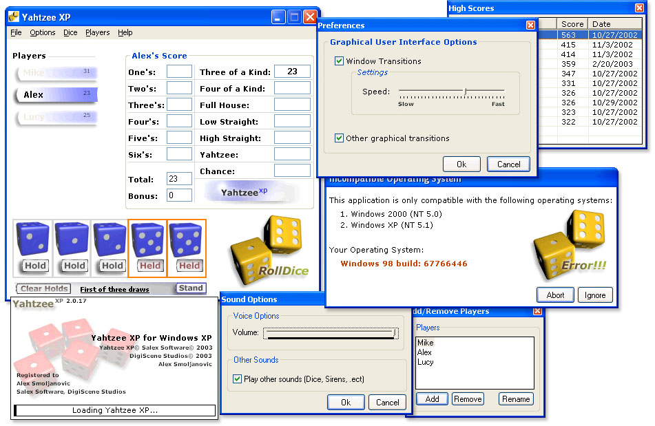



## Yahtzee XP

### Description

Yahtzee XP - Fully Featured Game.

Features include: Save Game, Load Game, Multi-player, Click-2-Pick Score Box, TruVoice DirectSS Game Play Narrator, Multi-Colored 3D Dice, complete Help File(Help File Project included), and more. Application uses Learnout & Haupsies TruVoice Speech Synthesization, due to other functionality this application is only compatible on Windows NT 5(Win2k) and Windows NT 5.1(XP). Project was requested by a user of an old version of a 1996 Yahtzee game who wanted to improve an allready addicting game. All graphical resources were not included due to their collective size, however, they are available on request(Photoshop Files, 3DSM 5.1 Dice Model, Bitmaps). Thank you, Alex Smoljanovic - Salex Software (C) 2003
 
### More Info
 

             |
---                |---
**Submitted On**   |2003-02-21 03:18:34
**By**             |[Alex Smoljanovic\(aLeX^rS\)](https://github.com/Planet-Source-Code/PSCIndex/blob/master/ByAuthor/alex-smoljanovic-alex-rs.md)
**Level**          |Intermediate
**User Rating**    |4.7 (90 globes from 19 users)
**Compatibility**  |VB 5\.0, VB 6\.0
**Category**       |[Games](https://github.com/Planet-Source-Code/PSCIndex/blob/master/ByCategory/games__1-38.md)
**World**          |[Visual Basic](https://github.com/Planet-Source-Code/PSCIndex/blob/master/ByWorld/visual-basic.md)
**Archive File**   |[Yahtzee\_XP1547932212003\.zip](https://github.com/Planet-Source-Code/alex-smoljanovic-alex-rs-yahtzee-xp__1-43402/archive/master.zip)

